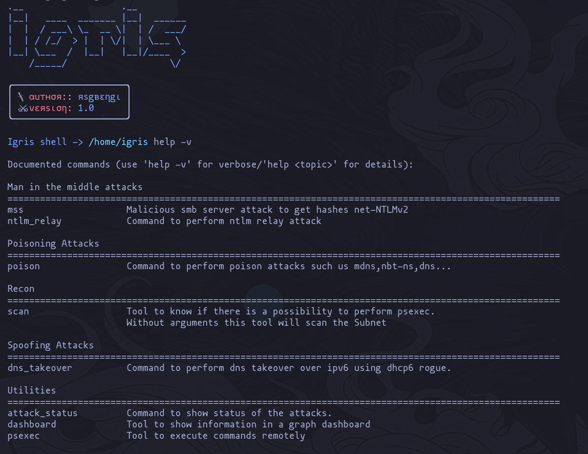
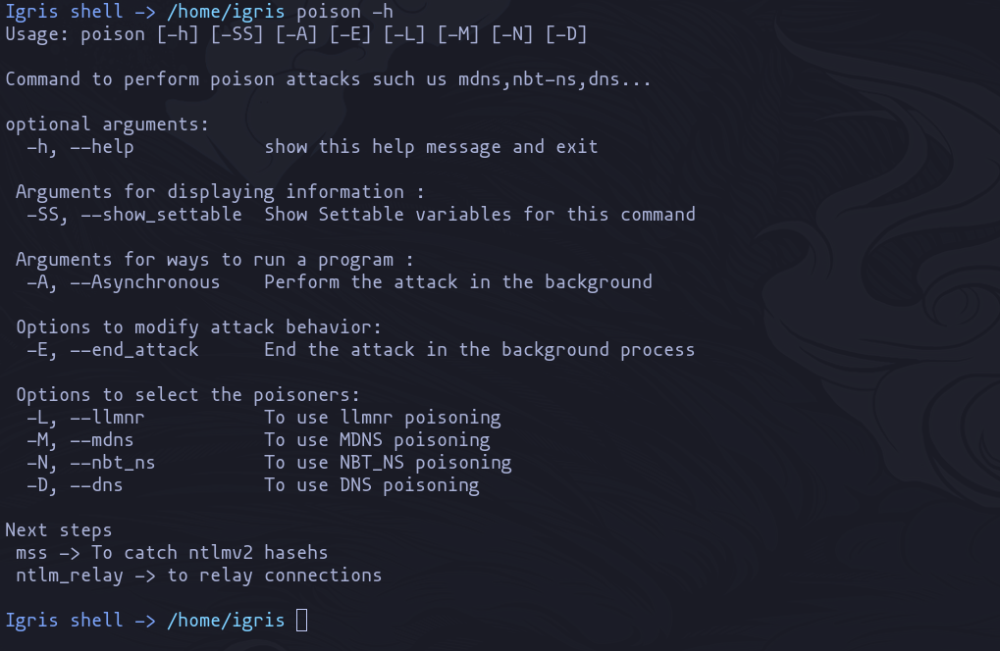

<h1 align="center">
  <a href="https://github.com/rsgbengi/Igris.git">
    <!-- Please provide path to your logo here -->
    
  </a>
  <br>
  Igris
</h1>

<div align="center">
  <h4> Python tool to audit active directory environments.</h4>
</div>

<div align="center">
<br />

[](LICENSE)

[](https://github.com/rsgbengi)

</div>

<details open="open">
<summary>Table of Contents</summary>

- [About](#about)
  - [Built With](#built-with)
    - [Main Python modules](#main-python-modules)
    - [Technologies](#technologies)
- [Documentation](#documentation)
- [Getting Started](#getting-started)
  - [Prerequisites](#prerequisites)
  - [Installation](#installation)
- [Key feautres](#key-feautres)
- [Usage](#usage)
- [Next Features](#next-features)
- [Project assistance](#project-assistance)
- [Contributing](#contributing)
- [Authors & contributors](#authors--contributors)
- [Security](#security)
- [License](#license)

</details>

---

## About

<table><tr><td>
Igris is a tool made in Python oriented mainly to facilitate audits (penetration tests or pentesting) in Microsoft Windows specifically in the active directory. The main objective has been to develop a complete framework that has different commands that allow its users to carry out the classic attacks that are usually done when auditing an active directory environment.

<details>
<summary>Screenshot</summary>
<br>


|                             Banner                             |                         Example of command                          |
| :------------------------------------------------------------: | :-----------------------------------------------------------------: |
|  |  |

</details>

</td></tr></table>

### Built With

#### Main Python modules
- [Cmd2](https://cmd2.readthedocs.io/en/stable/)
- [Impacket](https://github.com/SecureAuthCorp/impacket)
- [Rich](https://github.com/Textualize/rich)
- [Pypsexec](https://pypi.org/project/pypsexec/)
- [Scapy](https://scapy.net/)
- [Py2neo](https://py2neo.org/2021.1/)
- [Dash](https://github.com/plotly/dash)
#### Technologies 
- [Neo4j](https://neo4j.com/)
- [Docker](https://www.docker.com/)

## Documentation 
To learn more about how to use the tool, it is recommended to view the official [documentation](https://rsgbengi.gitbook.io/igris/).
## Getting Started

### Prerequisites
- Installation of [docker](https://docs.docker.com/engine/install/ubuntu/) and [docker-compose](https://github.com/docker/compose). 

### Installation
In the main project directory run:
```bash
docker-compose build 
docker-compose run igris
```
## Key feautres
- Custom CLI
- mDNS, NBT-NS, DNS AND LLMNR poisoners
- SMB server to get net-ntlmv2 hashes 
- *NTLM Relay* attack
- Domain recognition using the SMB protocol
- Remote command execution using psexec (cmd.exe and powershell.exe interactive)
- Built-in *pass the hash* technique for both remote execution and recognition
- Representation of the information obtained through a control panel that makes use of neo4j


## Usage
<details>
<summary>Commands</summary>

```
Documented commands (use 'help -v' for verbose/'help <topic>' for details):

Man in the middle attacks
======================================================================================================
mss                   Malicious smb server attack to get hashes net-NTLMv2                            
ntlm_relay            Command to perform ntlm relay attack                                            

Poisoning Attacks
======================================================================================================
poison                Command to perform poison attacks such us mdns,nbt-ns,dns...                    

Recon
======================================================================================================
scan                  Tool to know if there is a possibility to perform psexec.                       
                      Without arguments this tool will scan the Subnet                                

Spoofing Attacks
======================================================================================================
dns_takeover          Command to perform dns takeover over ipv6 using dhcp6 rogue.                    

Utilities
======================================================================================================
attack_status         Command to show status of the attacks.                                          
dashboard             Tool to show information in a graph dashboard                                   
psexec                Tool to execute commands remotely                                               

Uncategorized
======================================================================================================
alias                 Manage aliases                                                                  
cd                    Change the directoy.                                                            
                      Usage:                                                                          
                      cd <new_dir>                                                                    
edit                  Run a text editor and optionally open a file with it                            
help                  List available commands or provide detailed help for a specific command         
history               View, run, edit, save, or clear previously entered commands                     
macro                 Manage macros                                                                   
quit                  Exit this application                                                           
run_pyscript          Run a Python script file inside the console                                     
run_script            Run commands in script file that is encoded as either ASCII or UTF-8 text       
set                   Set a settable parameter or show current settings of parameters                 
shell                 Execute a command as if at the OS prompt                                        
shortcuts             List available shortcuts     
```
</details>

<details>
<summary>poison</summary>

```
Usage: poison [-h] [-SS] [-A] [-E] [-L] [-M] [-N] [-D]

Command to perform poison attacks such us mdns,nbt-ns,dns...

optional arguments:
  -h, --help            show this help message and exit

 Arguments for displaying information :
  -SS, --show_settable  Show Settable variables for this command

 Arguments for ways to run a program :
  -A, --Asynchronous    Perform the attack in the background

 Options to modify attack behavior:
  -E, --end_attack      End the attack in the background process

 Options to select the poisoners:
  -L, --llmnr           To use llmnr poisoning
  -M, --mdns            To use MDNS poisoning
  -N, --nbt_ns          To use NBT_NS poisoning
  -D, --dns             To use DNS poisoning

Next steps
 mss -> To catch ntlmv2 hasehs
 ntlm_relay -> to relay connections
```
</details>
<details>
<summary>dns_takeover</summary>

```
Usage: dns_takeover [-h] [-SS] [-E] [-A] [-DOM DOMAIN] [-M MASK]

Command to perform dns takeover over ipv6 using dhcp6 rogue.

optional arguments:
  -h, --help            show this help message and exit

 Arguments for displaying information :
  -SS, --show_settable  Show Settable variables for this command

 Options to modify attack behavior:
  -E, --end_attack      End the attack in the background process

 Arguments for ways to run a program :
  -A, --Asynchronous    Perform the attack in the background

 Options to modify attack behavior:
  -DOM, --domain DOMAIN
                        Target domain: Ex: domain.local
  -M, --mask MASK       IPv6 mask: Ex: fe80::/64

Next Steps
-ntlm_relay -IP6 to relay credentials

```
</details>
<details>
<summary>mss</summary>

```
Usage: mss [-h] [-SS] [-A] [-E] [-ON OUTPUT_NTLMV2]

Malicious smb server attack to get hashes net-NTLMv2 

optional arguments:
  -h, --help            show this help message and exit

 Arguments for displaying information :
  -SS, --show_settable  Show Settable variables for this command

 Arguments for ways to run a program :
  -A, --Asynchronous    Perform the attack in the background. The results will be saved in log/hashes_ntlm

 Options to modify attack behavior:
  -E, --end_attack      End the attack in the background process
  -ON, --output_ntlmv2 OUTPUT_NTLMV2
                        Output of the hashes ntlmv2

Next steps
-Try to crack the ntlmv2 hashes in loot/[user].txt
        
-Use the scan command to identify potential users
-psexec with the 
        credentials after cracking them

```
</details>
<details>
<summary>ntlm_relay</summary>

```
Usage: ntlm_relay [-h] [-SS] [-SC] [-A] [-P] [-OS OUTPUT_SAM] [-E] [-IP6]

Command to perform ntlm relay attack

optional arguments:
  -h, --help            show this help message and exit

 Arguments for displaying information :
  -SS, --show_settable  Show Settable variables for this command
  -SC, --show_connections
                        Show current connections of the sock server

 Arguments for ways to run a program :
  -A, --Asynchronous    Perform the attack in the background

 Options to modify attack behavior:
  -P, --proxy           Use a proxy server
  -OS, --output_sam OUTPUT_SAM
                        Directory to save the SAM
  -E, --end_attack      End the attack in the background process
  -IP6, --ipv6          To attack with ipv6

Next step
-Use the scan command to identify potential users

```
</details>
<details>
<summary>scan</summary>

```
Usage: scan [-h] [-SI] [-SS] [-A] [-E]

Tool to know if there is a possibility to perform psexec. 
        Without arguments this tool will scan the Subnet

optional arguments:
  -h, --help            show this help message and exit

 Arguments for displaying information :
  -SI, --show_info      It shows the information of all the subnets of the current user 
                                    and password specified in the settable variables(USER, PASSWD)
  -SS, --show_settable  Show Settable variables for this command

 Arguments for ways to run a program :
  -A, --asynchronous    Run the command asynchronous. To use this functionality, 
                                the application must be running in a terminal that supports VT100 
                                control characters and readline
  -E, --end_scan        Finish the scan in the background

Next Steps
 psexec -> To get windows shell
```
</details>
<details>
<summary>dashboard</summary>

```
Usage: dashboard [-h] [-SS]

Tool to show information in a graph dashboard

optional arguments:
  -h, --help            show this help message and exit

 Arguments for displaying information :
  -SS, --show_settable  Show Settable variables for this command
```
</details>
<details>
<summary>psexec</summary>

```
Usage: psexec [-h] [-C COMMAND] [-I] [-ARG ARGUMENTS] [-E] [-CL] [-SS]

Tool to execute commands remotely

optional arguments:
  -h, --help            show this help message and exit

Options for running commands:
  -C, --command COMMAND
                        Run a command on the windows machine.
  -I, --interactive     For an interactive cmd.exe or powershell.exe
  -ARG, --arguments ARGUMENTS
                        Arguments for a selected command. If there is more than one, 
                                quotes must be used
  -E, --encryption      Argument to encrypt the communication. Encryption does not 
                                work with windows 7 and server 2008
  -CL, --clean_remote_files
                        Command to clean PaExec files on failure

 Arguments for displaying information :
  -SS, --show_settable  Show Settable variables for this command
```
</details>


## Next Features
- Improve dashboard.
- Improve management of when network resource resolution requests are answered.
- Incorporate methods to collect more domain information using powershell and LDAP
## Project assistance

If you want to say **thank you** or/and support active development of Igris:

- Add a [GitHub Star](https://github.com/rsgbengi/https://github.com/rsgbengi/Igris.git) to the project.
- Tweet about the Igris.
- Write interesting articles about the project on [Dev.to](https://dev.to/), [Medium](https://medium.com/) or your personal blog.

Together, we can make Igris **better**!

## Contributing

First off, thanks for taking the time to contribute! Contributions are what make the open-source community such an amazing place to learn, inspire, and create. Any contributions you make will benefit everybody else and are **greatly appreciated**.


Please read [our contribution guidelines](docs/CONTRIBUTING.md), and thank you for being involved!

## Authors & contributors

The original setup of this repository is by [Rubén Santos García](https://github.com/rsgbengi).

For a full list of all authors and contributors, see [the contributors page](https://github.com/rsgbengi/https://github.com/rsgbengi/Igris.git/contributors).

## Security

Igris follows good practices of security, but 100% security cannot be assured.
Igris is provided **"as is"** without any **warranty**. Use at your own risk.

_For more information and to report security issues, please refer to our [security documentation](docs/SECURITY.md)._

## License

This project is licensed under the **MIT license**.

See [LICENSE](LICENSE) for more information.

